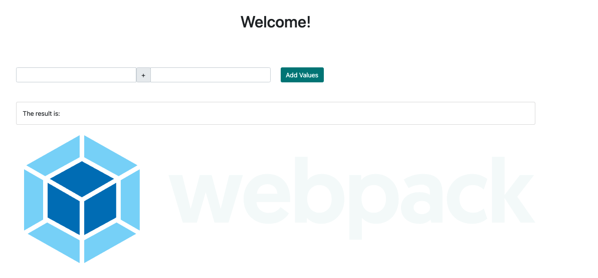

# webpack-tutorial

This app follows the Colt Steele webpack tutorial. I learned the basics of webpack in it. The app was arleady creted and I added webpack to it.



|                                         |                                         |                                                   |
| :-------------------------------------: | :-------------------------------------: | :-----------------------------------------------: |
|    [Introduction](#webpack-tutorial)    | [Table of Contents](#table-of-contents) | [Development Highlights](#development-highlights) |
|      [Installation](#intsallation)      |    [Page Directory](#page-directory)    |       [Code Hightlights](#code-highlights)        |
| [Technologies Used](#Technologies-Used) |           [Credits](#Credits)           |                [License](#License)                |

## Development Highlights

- Use html loader to dynamically created html
- Test for scss file and load it accordingly.
- Create a common, dev, and prod webpack.

## Installation

```
npm start
```

## Page Directiory

The build is cretated in the `dist` folder. There is a webpack for development and webpack for production.

## Code Highlights

Creting production webpack. Files get resolved in the dist directory. The files are minified and scss is applied to the files.

```JavaScript
module.exports = merge(common, {
    mode: "production",
    output: {
        filename: "[name].[contenthash].bundle.js",
        path: path.resolve(__dirname, "dist")
    },
    optimization: {
        minimizer: [
            new OptimizeCssAssetsPlugin(), new TerserPlugin(), new HtmlWebpackPlugin({
                template: "./src/template.html",
                minify: {
                    removeAttributeQuotes: true,
                    collapseWhitespace: true,
                    removeComments: true
                }
            })
        ]
    },
    module: {
        rules: [
            {
                test: /\.scss$/,
                use: [
                    MiniCssExtractPlugin.loader, //3. Inject styles into DOM
                    "css-loader", //2. Turns css into commonjs
                    "sass-loader" //1. Turns sass into css
                ]
            },
        ]
    },

    plugins: [new MiniCssExtractPlugin({ filename: "[name].[contenthash].css" }), new CleanWebpackPlugin()]
});
```

## Technologies

- [webpack](https://webpack.js.org/)

## Credits

The starter code was provided by Colt Steele. His [tutorial](https://www.youtube.com/watch?v=3On5Z0gjf4U&t=4s) was followed.

|                           |                                                                                                                                                                                                       |
| ------------------------- | ----------------------------------------------------------------------------------------------------------------------------------------------------------------------------------------------------- |
| **David Anusontarangkul** | [ LinkedIn](https://www.linkedin.com/in/anusontarangkul/) [ GitHub](https://github.com/anusontarangkul) |

## License

[](https://opensource.org/licenses/MIT)
